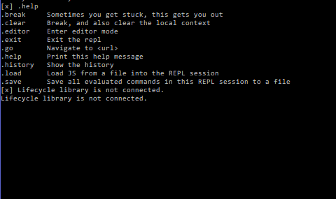

## Getting Started

## Installing Exokit

1. Be sure to grab a download for your OS [here](https://get.webmr.io/)
2. Run the downloaded file, and be sure to allow any security clearance the installer might need.
(For Linux: apt-get install libglu1-mesa-dev uuid-dev to run the build, we recommend this for devs.\)

3. Then let the installer work its magic for a minute or so and congratulations you're a proud user of Exokit!
 * For PC Users: Choose your desired folder location (note: if not installing into your main drive (C Drive for most) then you may have to go into the folder yourself after and find a file called 'exokit' which will be a windows command prompt)
 * For OSX Users: A window should open with the Exokit app file and your applications folder, simply drag Exokit into that folder.
 * For Linux Users: It should be in your PATH once the script is done, go ahead and `curl https://get.webmr.io/linux`(or wget) for further instructions
  
4. Go ahead and find/start the program `Exokit Browser`, and run it.
5. Now you are ready to start checking out sites and seeing what Exokit can do.


```$xslt
console.log("hello exokit!");
```

## Opening Websites and Examples

* When you run "Exokit Browser" a command prompt and a larger window will open, turn your attention to the larger window. In the window you will see a VR keyboard for our VR users (or legacy if you have time to kill), a URL bar, and flat boxes below the bar. 
* Those boxes are our "Featured Sites" from our [reddit](https://www.reddit.com/r/exokit/). Go ahead and enter any VR website URL, or point-and-click on any of the sites on the boxes below.

**Controls**

* When on a "non-VR only" (e.g. Magic Leap) form of entering Exokit, you will not be immediatly loaded into VR. Go ahead and hit enter VR with the `i` key, enter VR on a Magic Leap with the `o` key.
* For Menu Access (the homepage URL bar and keyboard), "E" opens menu if using a keyboard, with a HTC Vive, accessing the menu comes by hitting the button ABOVE the thumb trackpad.

## Examples

Let's open a ThreeJS website in Exokit.

Go to the ThreeJS [examples](https://threejs.org/examples/) page using your web browser of choice (Chrome, Firefox, etc):


These ThreeJS examples will run in Exokit, so lets get into it. Let's try the first one, [animation/cloth](https://threejs.org/examples/#webgl_animation_cloth). Observe that this is a WebGL site, and that it renders fine in Chrome:


Now we're going to open this same site using Exokit.

1. Open your Exokit Browser:


2. Then simply paste (Command-V) or type the link of the example into the URL bar:


3. Go ahead and hit enter (in VR or on your own keyboard), and the example should load up:


## Exokit's Command Prompt

The Exokit command prompt is a NodeJS REPL. If you're a node developer, the interface should be quite familiar. Open Exokit Command Prompt and run the command, `.help` :



To get to links from the command prompt itself, punch in the command: `.go`, then simply put in your desired URL.

This covers the basics of using Exokit. Thank you.
